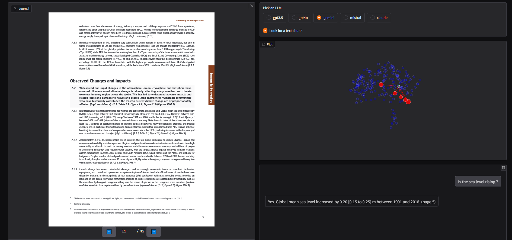

# Visualizing RAGs
Small tool to visualize the inner workings of RAG, used for teaching how RAGs work under the hood



## Usage

You'll need at least an OpenAI key to use this app since we're using it to as the embedding model. For the text generation, currently supported providers are: Mistral, Gemini, OpenAI and Anthropic.

We rely on the following environment variables, these can be put into a .env file in the root for ease of use:
- MISTRAL_API_KEY
- GOOGLE_API_KEY
- OPENAI_API_KEY
- ANTHROPIC_API_KEY

Then call app.py using the pdf path as a command line argument. Optionally, specify a chunk size in characters for text embedding.

For example on the provided document:
```
pip install -r requirements.txt
python app.py documents/IPCC_AR6_SYR_SPM.pdf --chunk-size 1000
```
